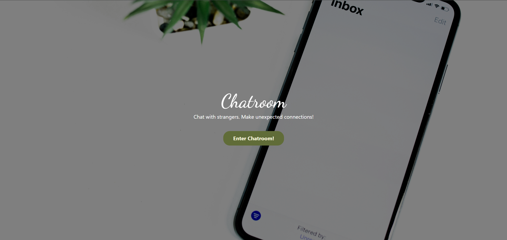
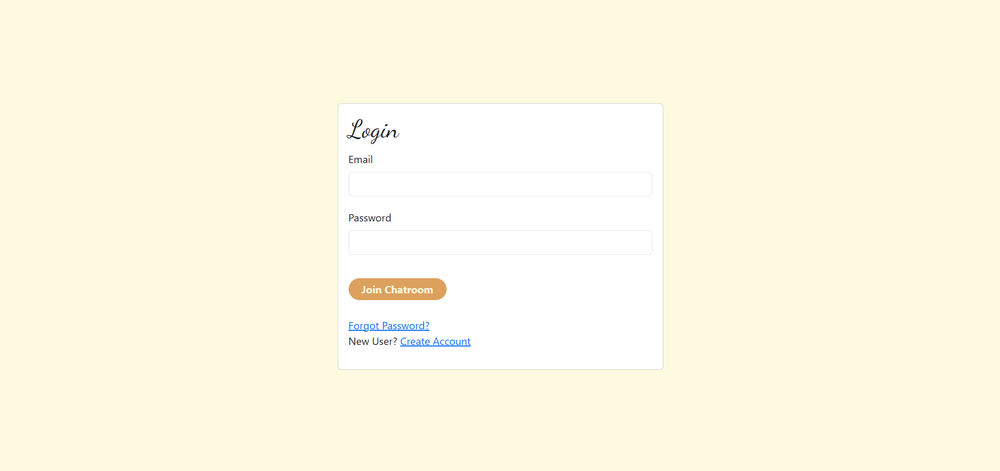
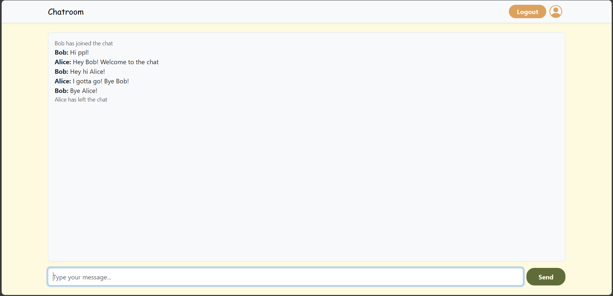

# 💬 Real-Time Chatroom App

A real-time chatroom application where users can register using email OTP verification and chat with strangers. Built with **Node.js**, **Express**, **Socket.IO**, and **MongoDB**.

## 🚀 Features

- 🔐 Email-based OTP registration
- 🔑 Secure user login/logout with sessions
- 💬 Real-time messaging using Socket.IO
- 🌙 Flash messages for errors and feedback
- 🗃️ Session storage with MongoDB
- 📬 Email verification via Nodemailer

## 🌐 Live Demo

👉 [View Live on Render](https://chatroom-62tx.onrender.com)

## 📸 Screenshots





## 🛠️ Tech Stack

- **Backend**: Node.js, Express.js
- **Frontend**: EJS, Bootstrap
- **Database**: MongoDB Atlas
- **WebSockets**: Socket.IO
- **Email**: Nodemailer
- **Session Store**: connect-mongo

## ⚙️ Setup Instructions

1. Clone the repository:
   ```bash
   git clone https://github.com/jeswindany/chatroom.git
   cd chatroom
   ```
2. Install dependencies:
   ```bash
   npm install
   ```
3. Create a .env file with the following:
   ```env
   MONGO_URL=your_mongo_uri
   SECRET=your_session_secret
   EMAIL_USER=your_email
   EMAIL_PASS=your_app_password
   ```
4. Start the server:
   ```bash
   npm start
   ```
5. Visit http://localhost:3000

## 🧾 License

This project is licensed under the [MIT License](LICENSE).
